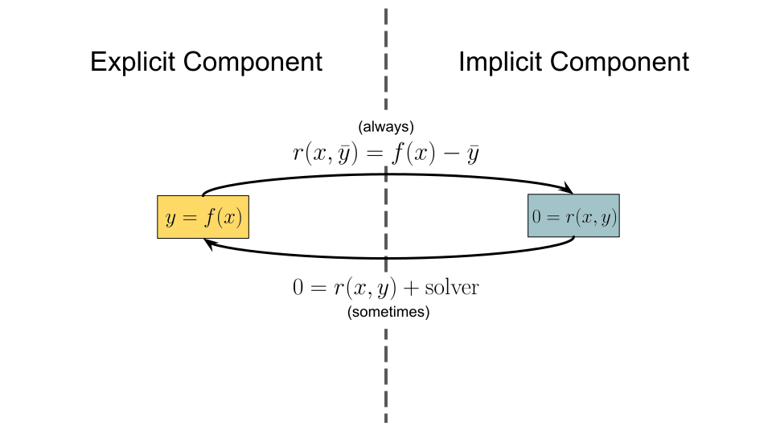
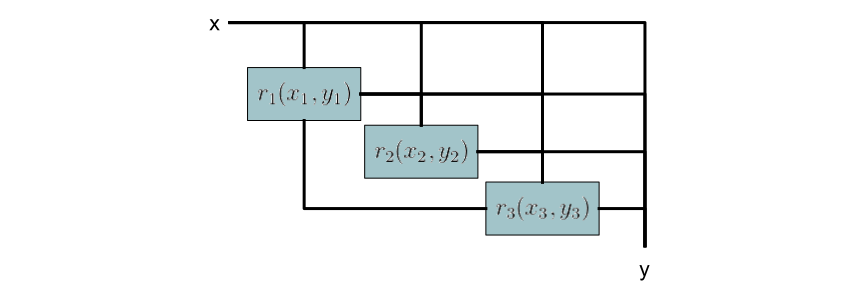
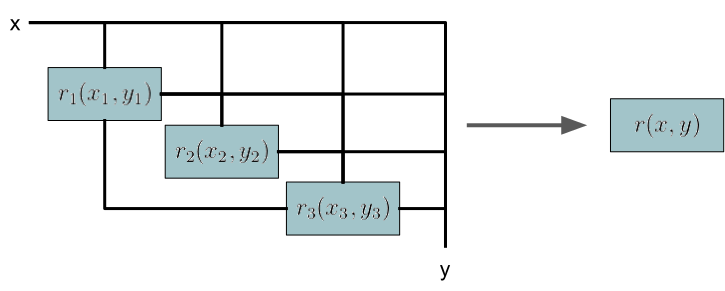

# Theory

CoupledSystems is developed around the idea that most functions and/or system components may be modeled as either an explicit vector valued function ``y = f(x)`` or an implicit vector-valued residual function ``0 = r(x, y)``, where ``x`` is a vector which contains the inputs to a system component and ``y`` is a vector which contains the outputs from a system component.  For implicit components, valid outputs correspond to those which satisfy the vector valued residual function ``0 = r(x,y)`` for a given set of inputs ``x``.

## The Relationship between Explicit and Implicit Components

Explicit components may easily be converted to implicit components by subtracting the provided outputs ``bar{y}`` from the actual outputs ``y = f(x)``, resulting in the following residual equation
```math
0 = r(x, \bar{y}) = f(x) - \bar{y}
```
Implicit components, on the other hand, may be effectively "seen" as explicit components once they are coupled with a solver which converges their residual equations to zero.  For example, while a computational fluid dynamics program internally solves an implicit system of equations to obtain fluid properties throughout a domain, programs which call the same CFD package effectively see the CFD package as an explicit component from which they expect to receive a converged set of outputs ``y`` given a set of inputs ``x``.

There is an important caveat in the effective conversion from implicit to explicit components.  While explicit components inherently contain a one-to-one mapping between inputs and outputs, the same is not true for implicit components.  Multiple sets of outputs may be able to satisfy the residual equations of an implicit component for a given set of inputs.  If a one-to-one mapping does not exist for a given implicit component, then the outputs from that component are dependent on the choice of solver and initial output guess in addition to the inputs (if a solution exists at all!).



## Derivatives of Explicit and Implicit Components

It is often useful to obtain the sensitivities of the outputs of a given system to its inputs.  This helps to both understand the system and inform gradient-based optimization.

The sensitivities of the outputs to the inputs for an explicit component is simply the partial derivative of the output function with respect to the inputs.
```math
\frac{dy}{dx} = \frac{\partial f}{\partial x}
```
The partial derivatives ``\frac{\partial f}{\partial x}`` may be computed analytically, with automatic differentiation, and/or with finite differencing.

To obtain the sensitivities of the outputs with respect to the inputs for an implicit component we first take the total derivative of the residual function with respect to the inputs.
```math
\frac{dr}{dx} = \frac{\partial r}{\partial x} + \frac{\partial r}{\partial y}\frac{dy}{dx}
```
The total derivative ``frac{dr}{dx}`` in this expression is zero since any change in the inputs for a valid set of outputs will still result in a zero-valued residual function.
```math
0 = \frac{\partial r}{\partial x} + \frac{\partial r}{\partial y}\frac{dy}{dx}
```
We now manipulate this expression to obtain the derivative of the outputs with respect to the inputs.
```math
\frac{dy}{dx} = -\left(\frac{\partial r}{\partial y}\right)^{-1}\frac{\partial r}{\partial x}
```
The partial derivatives ``\frac{\partial r}{\partial x}`` and ``\frac{\partial r}{\partial y}`` may be computed analytically, with automatic differentiation, and/or with finite differencing.  Note that the converged set of outputs ``y`` must be used when calculating the partials to obtain a valid set of derivatives.

## Explicit Systems

We define an explicit system as a system containing explicit components where each component's inputs correspond to either one of the previously evaluated component's outputs or the system inputs.  An illustration of an explicit system is shown in the following diagram.


An explicit system maps a set of inputs to a set of outputs through an explicit input-output relationship.  It may therefore be seen as a single explicit component composed of multiple explicit components.


Since there are no implicit dependencies in an explicit system, the chain rule may be used in forward or reverse mode to calculate the derivatives of the outputs with respect to the inputs.  

The computational cost of applying the chain rule scales linearly with either the inputs or outputs depending on whether the chain rule is applied in forward or reverse mode respectively.  It is therefore advised to apply the chain rule in forward mode if the number of outputs exceeds the number of inputs and reverse mode otherwise.

## Implicit Systems

We define an implicit system as a system containing implicit components where the system's residuals and outputs correspond to each of its subcomponents residuals and outputs concatenated.  The inputs to each subcomponent may correspond to the system inputs and/or the outputs of any other subcomponent.  An illustration of an implicit system is shown in the following diagram.



Since explicit components may be easily converted to implicit components, implicit systems may be used to model any combination of explicit and implicit components.  Implicit systems may be viewed as a single implicit component with a set of residual equations and outputs corresponding to those of its subcomponents.



The partial derivatives of an implicit system with respect to its inputs and outputs may be constructed using the partial derivatives of its subcomponents with respect to their inputs and outputs.  In many cases, the resulting matrix will be sparse.

## Analytical Sensitivity Equations

As we have defined them, the outputs of implicit components (including implicit systems) are identical to the state variables of the system.  In many cases, however, implicit components are coupled with output equations which calculate a relatively small number of important outputs from the inputs and state variables of an implicit component.  In this case, we can apply the analytic sensitivity equations to drastically reduce the computational cost of computing the derivatives of the implicit component.  

The cost of applying the analytic sensitivity equations scales linearly with the number of inputs or outputs in direct or adjoint mode respectively. It is therefore advised to use the direct mode of the analytic sensitivity equations when the number of outputs exceeds the number of inputs and adjoint mode otherwise.

## Reducing Systems of Components to a Single Explicit Component

Any system composed of explicit and implicit components may be reduced to a single explicit component.  For example, all components may be converted into implicit components, combined into a single implicit system, and then converted to an explicit component.  Alternatively, interdependent components may be combined together into implicit systems which may then be converted into explicit components and then combined with other explicit components into an explicit system.  While the result of the different approaches is the same, the computationally efficiency may vary.  For example, the latter approach for combining components together is likely more computationally efficient than the former approach.   In any case, once the system has been reduced into a single explicit component, that component may be used to easily obtain outputs and derivatives of the outputs with respect to the inputs given a set of inputs.
